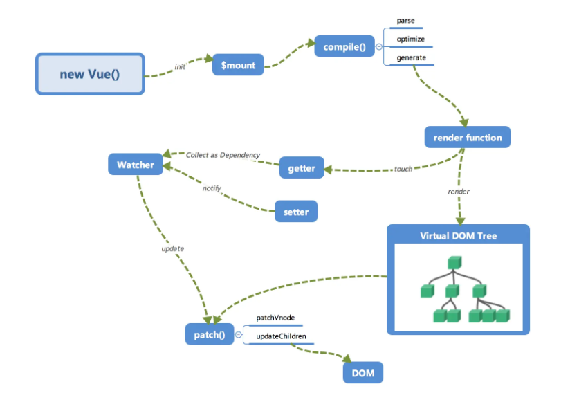
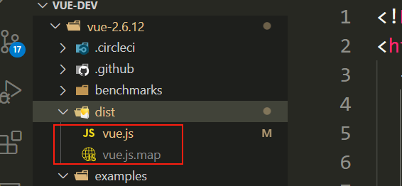
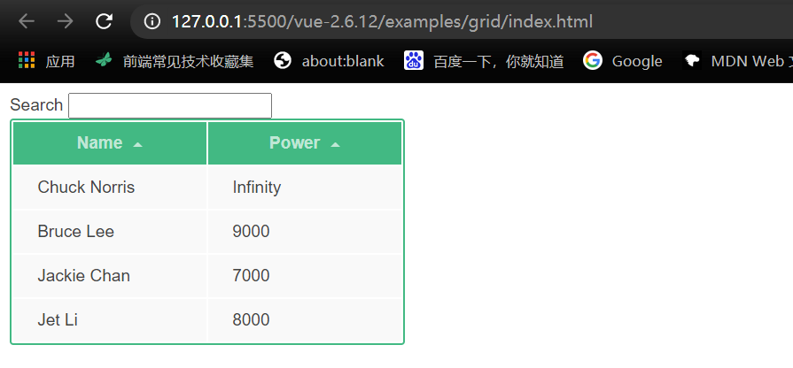
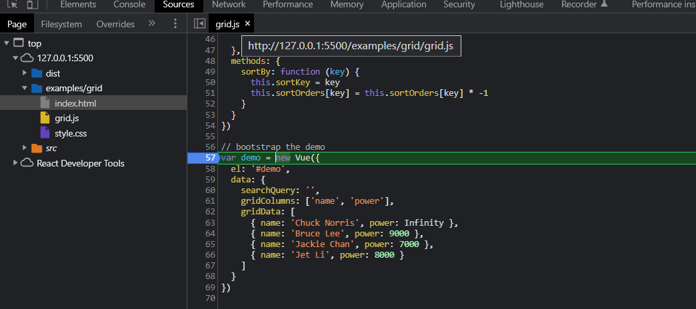
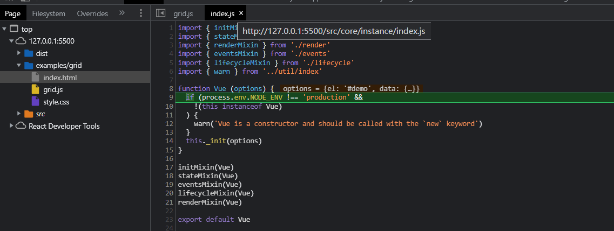
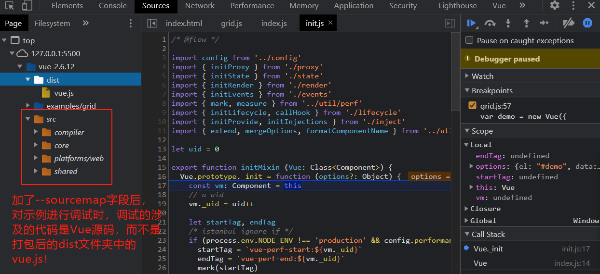

<p align="center"><a href="https://vuejs.org" target="_blank" rel="noopener noreferrer"></a></p>

<p align="center">
  <a href="https://circleci.com/gh/vuejs/vue/tree/dev"></a>
  <a href="https://codecov.io/github/vuejs/vue?branch=dev"></a>
  <a href="https://npmcharts.com/compare/vue?minimal=true"></a>
  <a href="https://www.npmjs.com/package/vue"></a>
  <a href="https://www.npmjs.com/package/vue"></a>
  <a href="https://chat.vuejs.org/"></a>
  <br>
  <a href="https://app.saucelabs.com/builds/50f8372d79f743a3b25fb6ca4851ca4c"></a>
</p>


<h2 align="center">代码调试</h2>

### 1. Vue.js内部运行机制流程图



### 2. 内容参看

配套学习博客：[Vue.js 技术揭秘](https://ustbhuangyi.github.io/vue-analysis/)。

### 3. 调试前置工作

为了便于调试，我们需要如下操作：

**首先**，进入Vue的项目根目录，通过以下命令安装相关依赖（如果安装失败了则使用cnpm安装模块）：

```
$ npm install
```

**其次**，给 `package.json` 文件中的 dev 脚本中添加参数 `--sourcemap`（便于后续调试，内容如下），然后删除`dist`文件夹，重新输入`npm run dev`进行打包（打包的路径不能包含中文，否则可能打包失败）：

```json
{
  scripts: {
    "dev": "rollup -w -c scripts/config.js --sourcemap --environment TARGET:web-full-dev",
  }
}
```

对使用rollup进行打包的 `dev` 脚本中参数解释如下：

- `-w`：监听文件的变化，文件变化自动重新打包
- `-c`：执行rollup打包时遵循的配置内容
- `--environment`：打包后的Vue的使用版本

使用以上命令打包生成的目录结构如下：



**然后**，我们打开 `examples/grid` 文件夹（以此为例），更改 `index.html` 导入的Vue文件，将 `vue.min.js` 更改为上边打包生成的 `vue.js`，使用 `http-server` 或者 `Live Server` 打开该示例文件，结果如下：



最后，打开 Chrome 的调试工具中的 `source`面板（配置了 `--sourcemap` 才能看到如下的`src`文件夹），我们可以看到：



按F11，就可以进入Vue内部源码了，而不是 `dist` 文件夹中打包后的代码：





至此，调试准备工作完成！

另外，为了分析 Vue 的编译过程，这里选择 **`runtime + compiler`版本（即TARGET为`web-full-dev`）的Vue的入口文件为：`src/platforms/web/entry-runtime-with-compiler.js`** 作为分析入口文件。

还有就是，当我们在项目开发中执行 `import Vue from 'vue'` 的时候，就是从这个入口开始去执行代码来初始化 Vue 的。

### 4. 调试例子查看

针对简单的示例，那么直接在 `examples/00-vue-analysis` 目录中，通过一个个 `.html` 文件打断点进行调试。

对于涉及 sfc 的调试，则参看 `examples/vue-cli-vue2.6-project` 工程进行调试，对应于不同的调试需求，选择用打 tag 的方式记录不同的示例。


<h2 align="center">Supporting Vue.js</h2>

Vue.js is an MIT-licensed open source project with its ongoing development made possible entirely by the support of these awesome [backers](https://github.com/vuejs/vue/blob/dev/BACKERS.md). If you'd like to join them, please consider:

- [Become a backer or sponsor on Patreon](https://www.patreon.com/evanyou).
- [Become a backer or sponsor on Open Collective](https://opencollective.com/vuejs).
- [One-time donation via PayPal or crypto-currencies.](https://vuejs.org/support-vuejs/#One-time-Donations)

#### What's the difference between Patreon and OpenCollective?

Funds donated via Patreon go directly to support Evan You's full-time work on Vue.js. Funds donated via OpenCollective are managed with transparent expenses and will be used for compensating work and expenses for core team members or sponsoring community events. Your name/logo will receive proper recognition and exposure by donating on either platform.

<h3 align="center">Special Sponsors</h3>
<!--special start-->

<p align="center">
  <a href="https://autocode.com/" target="_blank">
    
  </a>
</p>

<!--special end-->

<h3 align="center">Platinum Sponsors</h3>

<!--platinum start-->
<table>
  <tbody>
    <tr>
      <td align="center" valign="middle">
        <a href="https://vueschool.io/?utm_source=Vuejs.org&utm_medium=Banner&utm_campaign=Sponsored%20Banner&utm_content=V1" target="_blank">
          
        </a>
      </td>
      <td align="center" valign="middle">
        <a href="https://vehikl.com/" target="_blank">
          
        </a>
      </td>
      <td align="center" valign="middle">
        <a href="https://retool.com/?utm_source=sponsor&utm_campaign=vue" target="_blank">
          
        </a>
      </td>
      <td align="center" valign="middle">
        <a href="https://passionatepeople.io/" target="_blank">
          
        </a>
      </td>
    </tr><tr></tr>
    <tr>
      <td align="center" valign="middle">
        <a href="https://www.storyblok.com" target="_blank">
          
        </a>
      </td>
      <td align="center" valign="middle">
        <a href="https://ionicframework.com/vue?utm_source=partner&utm_medium=referral&utm_campaign=vuesponsorship&utm_content=vuedocs" target="_blank">
          
        </a>
      </td>
      <td align="center" valign="middle">
        <a href="https://nuxtjs.org/" target="_blank">
          
        </a>
      </td>
    </tr><tr></tr>
  </tbody>
</table>
<!--platinum end-->

<!--special-china start-->
<h3 align="center">Platinum Sponsors (China)</h3>
<table>
  <tbody>
    <tr>
      <td align="center" valign="middle">
        <a href="http://www.dcloud.io/?hmsr=vuejsorg&hmpl=&hmcu=&hmkw=&hmci=" target="_blank">
          
        </a>
      </td>
    </tr><tr></tr>
  </tbody>
</table>
<!--special-china end-->

<h3 align="center">Gold Sponsors</h3>

<!--gold start-->
<table>
  <tbody>
    <tr>
      <td align="center" valign="middle">
        <a href="https://www.vuemastery.com/" target="_blank">
          
        </a>
      </td>
      <td align="center" valign="middle">
        <a href="https://laravel.com" target="_blank">
          
        </a>
      </td>
      <td align="center" valign="middle">
        <a href="https://htmlburger.com" target="_blank">
          
        </a>
      </td>
      <td align="center" valign="middle">
        <a href="https://www.frontenddeveloperlove.com/" target="_blank">
          
        </a>
      </td>
      <td align="center" valign="middle">
        <a href="https://onsen.io/vue/" target="_blank">
          
        </a>
      </td>
      <td align="center" valign="middle">
        <a href="https://neds.com.au/" target="_blank">
          
        </a>
      </td>
    </tr><tr></tr>
    <tr>
      <td align="center" valign="middle">
        <a href="https://icons8.com/" target="_blank">
          
        </a>
      </td>
      <td align="center" valign="middle">
        <a href="https://vuejobs.com/?ref=vuejs" target="_blank">
          
        </a>
      </td>
      <td align="center" valign="middle">
        <a href="https://tidelift.com/subscription/npm/vue" target="_blank">
          
        </a>
      </td>
      <td align="center" valign="middle">
        <a href="https://www.firesticktricks.com/" target="_blank">
          
        </a>
      </td>
      <td align="center" valign="middle">
        <a href="https://intygrate.com/" target="_blank">
          
        </a>
      </td>
      <td align="center" valign="middle">
        <a href="http://en.shopware.com/" target="_blank">
          
        </a>
      </td>
    </tr><tr></tr>
    <tr>
      <td align="center" valign="middle">
        <a href="https://www.vpnranks.com/" target="_blank">
          
        </a>
      </td>
      <td align="center" valign="middle">
        <a href="https://www.bacancytechnology.com/hire-vuejs-developer" target="_blank">
          
        </a>
      </td>
      <td align="center" valign="middle">
        <a href="https://www.bestvpn.co/" target="_blank">
          
        </a>
      </td>
      <td align="center" valign="middle">
        <a href="https://www.y8.com/" target="_blank">
          
        </a>
      </td>
      <td align="center" valign="middle">
        <a href="https://js.devexpress.com/" target="_blank">
          
        </a>
      </td>
      <td align="center" valign="middle">
        <a href="https://fastcoding.jp/javascript/ " target="_blank">
          
        </a>
      </td>
    </tr><tr></tr>
    <tr>
      <td align="center" valign="middle">
        <a href="https://usave.co.uk/utilities/broadband" target="_blank">
          
        </a>
      </td>
      <td align="center" valign="middle">
        <a href="https://www.foo.software" target="_blank">
          
        </a>
      </td>
      <td align="center" valign="middle">
        <a href="https://flatlogic.com/templates" target="_blank">
          
        </a>
      </td>
      <td align="center" valign="middle">
        <a href="http://moovweb.com/" target="_blank">
          
        </a>
      </td>
      <td align="center" valign="middle">
        <a href="https://vpn-review.com/netflix-vpn" target="_blank">
          
        </a>
      </td>
      <td align="center" valign="middle">
        <a href="https://cosmos.network/" target="_blank">
          
        </a>
      </td>
    </tr><tr></tr>
    <tr>
      <td align="center" valign="middle">
        <a href="https://www.okayhq.com/" target="_blank">
          
        </a>
      </td>
      <td align="center" valign="middle">
        <a href="https://www.vpsserver.com" target="_blank">
          
        </a>
      </td>
      <td align="center" valign="middle">
        <a href="https://aussiecasinohex.com/" target="_blank">
          
        </a>
      </td>
      <td align="center" valign="middle">
        <a href="https://litslink.com" target="_blank">
          
        </a>
      </td>
      <td align="center" valign="middle">
        <a href="https://newicon.net" target="_blank">
          
        </a>
      </td>
      <td align="center" valign="middle">
        <a href="https://lowdefy.com?k=w432" target="_blank">
          
        </a>
      </td>
    </tr><tr></tr>
    <tr>
      <td align="center" valign="middle">
        <a href="https://quickbookstoolhub.com/" target="_blank">
          
        </a>
      </td>
    </tr><tr></tr>
  </tbody>
</table>
<!--gold end-->

<h3 align="center">Sponsors via <a href="https://opencollective.com/vuejs">Open Collective</a></h3>

<h4 align="center">Platinum</h4>

<a href="https://opencollective.com/vuejs/tiers/platinum-sponsors/0/website" target="_blank" rel="noopener noreferrer"></a>
<a href="https://opencollective.com/vuejs/tiers/platinum-sponsors/1/website" target="_blank" rel="noopener noreferrer"></a>

<h4 align="center">Gold</h4>

<a href="https://opencollective.com/vuejs/tiers/gold-sponsors/0/website" target="_blank" rel="noopener noreferrer"></a>
<a href="https://opencollective.com/vuejs/tiers/gold-sponsors/1/website" target="_blank" rel="noopener noreferrer"></a>
<a href="https://opencollective.com/vuejs/tiers/gold-sponsors/2/website" target="_blank" rel="noopener noreferrer"></a>
<a href="https://opencollective.com/vuejs/tiers/gold-sponsors/3/website" target="_blank" rel="noopener noreferrer"></a>
<a href="https://opencollective.com/vuejs/tiers/gold-sponsors/4/website" target="_blank" rel="noopener noreferrer"></a>

---

## Introduction

Vue (pronounced `/vjuː/`, like view) is a **progressive framework** for building user interfaces. It is designed from the ground up to be incrementally adoptable, and can easily scale between a library and a framework depending on different use cases. It consists of an approachable core library that focuses on the view layer only, and an ecosystem of supporting libraries that helps you tackle complexity in large Single-Page Applications.

#### Browser Compatibility

Vue.js supports all browsers that are [ES5-compliant](https://kangax.github.io/compat-table/es5/) (IE8 and below are not supported).

## Ecosystem

| Project | Status | Description |
|---------|--------|-------------|
| [vue-router]          | [![vue-router-status]][vue-router-package] | Single-page application routing |
| [vuex]                | [![vuex-status]][vuex-package] | Large-scale state management |
| [vue-cli]             | [![vue-cli-status]][vue-cli-package] | Project scaffolding |
| [vue-loader]          | [![vue-loader-status]][vue-loader-package] | Single File Component (`*.vue` file) loader for webpack |
| [vue-server-renderer] | [![vue-server-renderer-status]][vue-server-renderer-package] | Server-side rendering support |
| [vue-class-component] | [![vue-class-component-status]][vue-class-component-package] | TypeScript decorator for a class-based API |
| [vue-rx]              | [![vue-rx-status]][vue-rx-package] | RxJS integration |
| [vue-devtools]        | [![vue-devtools-status]][vue-devtools-package] | Browser DevTools extension |

[vue-router]: https://github.com/vuejs/vue-router
[vuex]: https://github.com/vuejs/vuex
[vue-cli]: https://github.com/vuejs/vue-cli
[vue-loader]: https://github.com/vuejs/vue-loader
[vue-server-renderer]: https://github.com/vuejs/vue/tree/dev/packages/vue-server-renderer
[vue-class-component]: https://github.com/vuejs/vue-class-component
[vue-rx]: https://github.com/vuejs/vue-rx
[vue-devtools]:  https://github.com/vuejs/vue-devtools

[vue-router-status]: https://img.shields.io/npm/v/vue-router.svg
[vuex-status]: https://img.shields.io/npm/v/vuex.svg
[vue-cli-status]: https://img.shields.io/npm/v/@vue/cli.svg
[vue-loader-status]: https://img.shields.io/npm/v/vue-loader.svg
[vue-server-renderer-status]: https://img.shields.io/npm/v/vue-server-renderer.svg
[vue-class-component-status]: https://img.shields.io/npm/v/vue-class-component.svg
[vue-rx-status]: https://img.shields.io/npm/v/vue-rx.svg
[vue-devtools-status]: https://img.shields.io/chrome-web-store/v/nhdogjmejiglipccpnnnanhbledajbpd.svg

[vue-router-package]: https://npmjs.com/package/vue-router
[vuex-package]: https://npmjs.com/package/vuex
[vue-cli-package]: https://npmjs.com/package/@vue/cli
[vue-loader-package]: https://npmjs.com/package/vue-loader
[vue-server-renderer-package]: https://npmjs.com/package/vue-server-renderer
[vue-class-component-package]: https://npmjs.com/package/vue-class-component
[vue-rx-package]: https://npmjs.com/package/vue-rx
[vue-devtools-package]: https://chrome.google.com/webstore/detail/vuejs-devtools/nhdogjmejiglipccpnnnanhbledajbpd

## Documentation

To check out [live examples](https://vuejs.org/v2/examples/) and docs, visit [vuejs.org](https://vuejs.org).

## Questions

For questions and support please use [the official forum](https://forum.vuejs.org) or [community chat](https://chat.vuejs.org/). The issue list of this repo is **exclusively** for bug reports and feature requests.

## Issues

Please make sure to read the [Issue Reporting Checklist](https://github.com/vuejs/vue/blob/dev/.github/CONTRIBUTING.md#issue-reporting-guidelines) before opening an issue. Issues not conforming to the guidelines may be closed immediately.

## Changelog

Detailed changes for each release are documented in the [release notes](https://github.com/vuejs/vue/releases).

## Stay In Touch

- [Twitter](https://twitter.com/vuejs)
- [Blog](https://medium.com/the-vue-point)
- [Job Board](https://vuejobs.com/?ref=vuejs)

## Contribution

Please make sure to read the [Contributing Guide](https://github.com/vuejs/vue/blob/dev/.github/CONTRIBUTING.md) before making a pull request. If you have a Vue-related project/component/tool, add it with a pull request to [this curated list](https://github.com/vuejs/awesome-vue)!

Thank you to all the people who already contributed to Vue!

<a href="https://github.com/vuejs/vue/graphs/contributors"></a>


## License

[MIT](https://opensource.org/licenses/MIT)

Copyright (c) 2013-present, Yuxi (Evan) You
